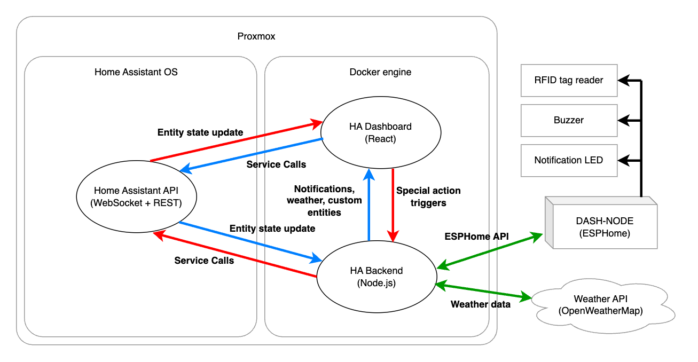

# Home Assistant backend

This is the Home Assistant backend, which is responsible for my smart home setup. Previously, I was using Node-RED for this purpose, but I decided to switch to a custom Node backend because it is more flexible and clear for me as a JavaScript developer.

Before, I reached a point where I did not know how to create a desired automation using the Node-RED blocks, but I knew how I would program it with normal code. I began to use the function blocks more and more often, so the idea of no-code stopped mattering to me, and I decided to move all my automations to code.

The dedicated frontend for this backend is [here](https://github.com/adan2013/HA-Dashboard).

## Scripts

| COMMAND           | DESCRIPTION                                         |
|-------------------|-----------------------------------------------------|
| yarn start        | start a developer server (HA service calls blocked) |
| yarn build        | build a production build                            |
| yarn start:prod   | start a developer server in production mode         |
| yarn start:build  | run a production build                              |
| yarn lint         | run eslint                                          |
| yarn test         | run unit tests                                      |
| yarn docker-build | build the docker image                              |
| yarn docker-run   | run the docker image                                |

## Environment variables

| VARIABLE        | DESCRIPTION                           |
|-----------------|---------------------------------------|
| TZ              | timezone ID                           |
| HA_HOST         | IP address of Home Assistant instance |
| HA_TOKEN        | access token for Home Assistant       |
| AQI_API_KEY     | access token for AQICN API            |
| WEATHER_API_KEY | access token for OpenWeatherMap API   |
| WEATHER_LAT     | weather coordinates - latitude        |
| WEATHER_LON     | weather coordinates - longitude       |

## Helpers

### DataCollector
Allows to store historical data in queue. For exaple, it is used to collect values of temperature, wind speed and pressure from the weather API.

## Services

### NotificationsService
Is responsible for controlling the active notifications which are displayed on the dashboard. It is also responsible for setting the notification light behind the tablet and playing sound alerts through the buzzer.

### WeatherService
Is collecting weather data from the OpenWeatherMap API by using "OneCall API 3.0". The air quality index is collected from the AQICN API, because I was unhappy with the measurement precision of the Air Pollution API from OpenWeatherMap.
