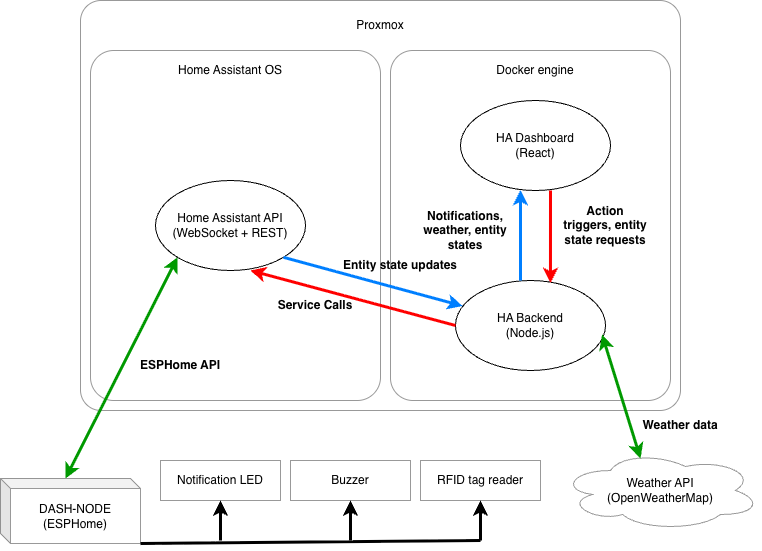

# Home Assistant backend

This is the Home Assistant backend, which is responsible for my smart home
setup and is the only Home Assistant integration point used by the dashboard.
Dashboard clients authenticate over WebSocket, subscribe to entity updates and
send commands through this backend. Home Assistant credentials remain on the
backend.

Previously, I was using Node-RED for this purpose, but I decided to switch to a
custom Node backend because it is more flexible and clear for me as a
JavaScript developer.

Before, I reached a point where I did not know how to create a desired automation using the Node-RED blocks, but I knew how I would program it with normal code. I began to use the function blocks more and more often, so the idea of no-code stopped mattering to me, and I decided to move all my automations to code.

The dedicated frontend for this backend is [here](https://github.com/adan2013/HA-Dashboard).

## Scripts

| COMMAND           | DESCRIPTION                                 |
| ----------------- | ------------------------------------------- |
| yarn dev          | start a developer server                    |
| yarn build        | build a production build                    |
| yarn start:prod   | start a developer server in production mode |
| yarn start:build  | run a production build                      |
| yarn lint         | run eslint                                  |
| yarn test         | run unit tests                              |
| yarn docker-build | build the docker image                      |
| yarn docker-run   | run the docker image                        |

## Environment variables

| VARIABLE               | DESCRIPTION                                                                  |
| ---------------------- | ---------------------------------------------------------------------------- |
| TZ                     | timezone ID                                                                  |
| HA_HOST                | IP address of Home Assistant instance                                        |
| HA_TOKEN               | access token for Home Assistant                                              |
| DASHBOARD_ACCESS_TOKEN | shared access token required by dashboard clients                            |
| AQI_API_KEY            | access token for AQICN API                                                   |
| AQI_STATION            | ID of the AQICN air quality station                                          |
| WEATHER_API_KEY        | access token for OpenWeatherMap API                                          |
| LOCATION_LAT           | house location - latitude                                                    |
| LOCATION_LON           | house location - longitude                                                   |
| LOG_DIR                | log directory (defaults to `logs` locally and `/opt/app/logs` in production) |

`HA_TOKEN` and `DASHBOARD_ACCESS_TOKEN` are runtime-only secrets. The Docker
image does not require either value while it is being built; pass them when the
container starts, for example with `docker run --env-file .env`.

The backend refuses to start without `DASHBOARD_ACCESS_TOKEN`. A dashboard must
send this token as its first WebSocket message. In development mode, automatic
HA service calls originating inside the backend are logged and blocked, while
explicit `callService` commands from the dashboard are executed.

## Logging

Application logs are written as structured JSON to stdout and to daily files in
`LOG_DIR`. The current file and six previous daily files are retained. A single
event is limited to 16 KiB. Authenticated dashboard clients can request the last
100 valid events; malformed or incomplete JSONL records are ignored.

## Portainer deployment

The included `compose.yaml` manages only the backend. The dashboard remains a
separate deployment. GitHub Actions builds and pushes
`adan2013/ha-backend:latest` after changes reach `main`.

To migrate an existing standalone backend container to a Portainer Stack:

1. Copy all environment variable values from the existing container. Do not
   remove it until the new Stack configuration is ready.
2. In Portainer, open **Stacks**, choose **Add stack**, and select
   **Git repository**.
3. Use `https://github.com/adan2013/HA-Backend.git` as the repository URL,
   `refs/heads/main` as the reference, and `compose.yaml` as the Compose path.
4. Add the existing values under **Environment variables** for `TZ`, `HA_HOST`,
   `HA_TOKEN`, `HA_REQUIRED_ENTITIES`, `DASHBOARD_ACCESS_TOKEN`, `AQI_API_KEY`,
   `AQI_STATION`, `WEATHER_API_KEY`, `LOCATION_LAT`, and `LOCATION_LON`.
5. Stop and remove the old standalone backend container so port `8008` becomes
   available, then deploy the Stack.
6. Confirm that the Stack created the `ha-backend-logs` named volume and that
   the backend service is healthy.

For later releases, wait for the GitHub **Build docker image** workflow to
finish. In Portainer, open the Stack and use **Pull and redeploy**, enabling
**Re-pull image** (called **Pull latest image** in older Portainer versions).
No additional GitHub secret or webhook is required.

## Helpers

### DataCollector

Allows to store historical data in queue. For exaple, it is used to collect values of temperature, wind speed and pressure from the weather API.

### DebouncedNumericToggle

Very useful tool that allows you to convert the numeric value to the toggle with the debounce functionality. I am using it to determine when my washing machine is working, depending on the power consumption reported by the smart plug.

### DoubleThresholdToggle

It is a simple tool that allows you to convert the numeric value to the toggle with the double threshold. I am using it to determine when is bright enough to turn off the auto-lights in the kitchen.

### StateMachine

Simple state machine implementation with implemented "auto-return" functionality and Type-Script support.

## Services

### BalconyController

The service is using the CRON job to turn on and off the Christmas lights on the balcony.

### DeviceMonitor

The service is responsible for monitoring the devices in the network. It is checking the availability of the devices and the battery levels.

### KitchenController

Custom logic for my automatic lights in the kitchen. It uses an Aqara motion and light sensor to automatically turn on the lights if someone enters the kitchen.

### LivingRoomController

Custom logic for all the lights in the living room. For now, it contains four different light sources and one Aqara Opple remote.

### NotificationsService

It is responsible for controlling the active notifications that are displayed on the dashboard. It is also responsible for setting the notification light behind the tablet and playing sound alerts through the buzzer.

### ReminderService

It is a group service that contains all the micro-integrations related to reminders - for example: ready laundry or opened main doors.

### WaterLeak

The service is responsible for monitoring the water leak sensors and triggering the notification and sound alarm if the water is detected.

### WeatherService

Is collecting weather data from the OpenWeatherMap API by using "OneCall API 3.0". The air quality index is collected from the AQICN API, because I was unhappy with the measurement precision of the Air Pollution API from OpenWeatherMap.
